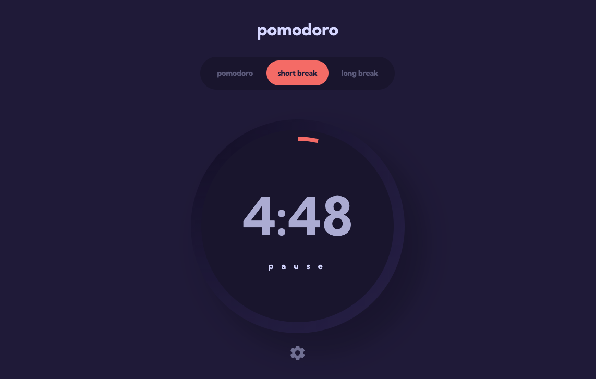

# Pomodoro app

[Frontend Mentor](https://www.frontendmentor.io/challenges/pomodoro-app-KBFnycJ6G)

## Overview

- Live Site URL: [Demo](https://your-live-site-url.com)

### The challenge

Users should be able to:

- Set a pomodoro timer and short & long break timers
- Customize how long each timer runs for
- See a circular progress bar that updates every minute and represents how far through their timer they are
- Customize the appearance of the app with the ability to set preferences for colors and fonts

### Screenshot

### Built with

- [React](https://reactjs.org/) - JS library
- [Next.js](https://nextjs.org/) - React framework
- [@emotion/styled](https://emotion.sh/docs/styled) - For styles
